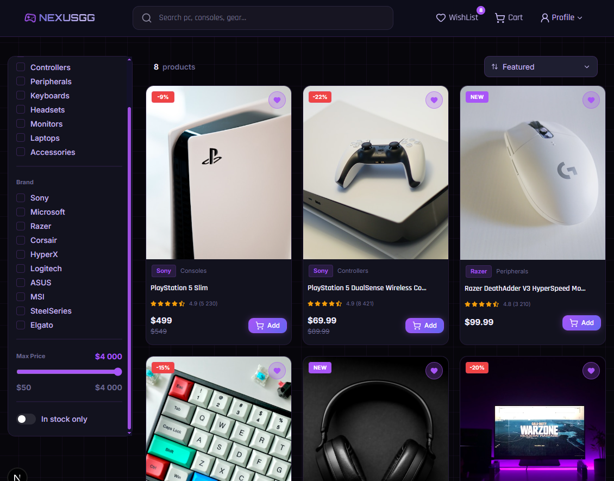
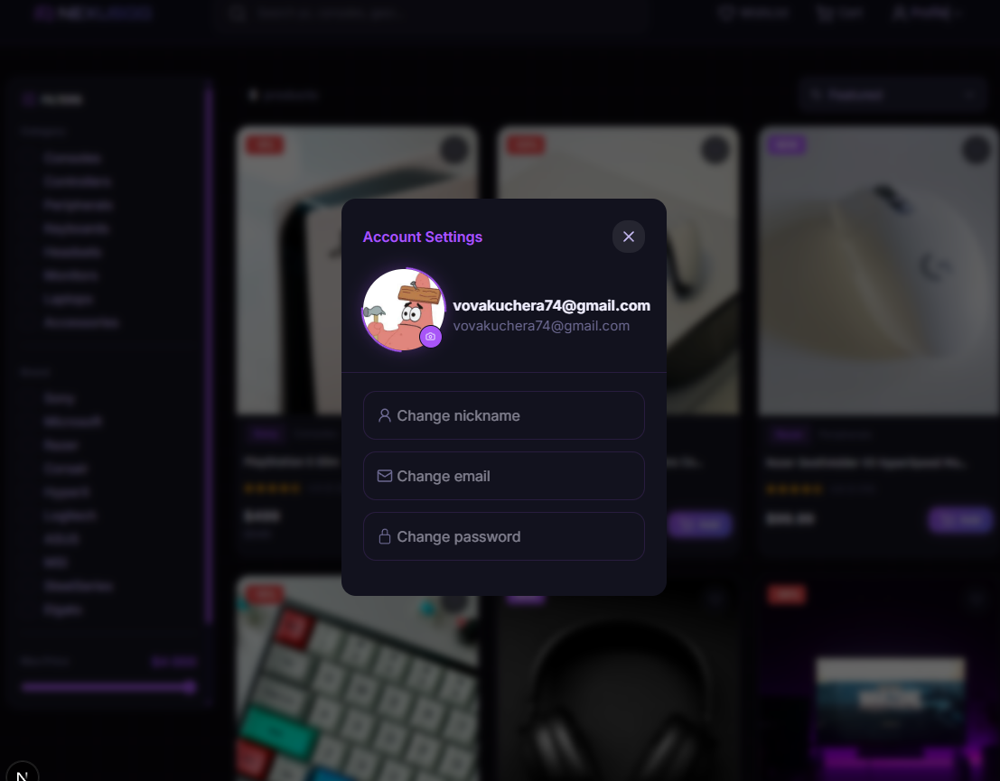

# 🎮 Nexus — Gaming Store

A full-featured gaming e-commerce store built with Next.js 16, Supabase, and TypeScript. Dark purple aesthetic, modern UI, and a complete shopping experience.

## 🔗 Demo

> [Live Demo](https://nexus.vercel.app) · [GitHub](https://github.com/vovakuchera74-max/nexus)

---

## 📸 Screenshots



---

## ✨ Features

- 🛍️ **Product Catalog** — grid and list view, with filtering by category, brand, price range, and stock
- 🔍 **Search** — debounced real-time search across all products
- 🛒 **Cart** — add/remove items, quantity control, subtotal — persisted in Zustand
- ❤️ **Wishlist** — save favorite items, with toggle and badge count
- 🔐 **Authentication** — email/password sign up & sign in, GitHub OAuth
- 👤 **Profile** — update username, email, and password from a settings modal
- 🎨 **Dark UI** — custom dark purple palette with hover effects and animations
- 📱 Responsive — desktop-first layout with slide-in filter drawer on mobile
- ⚙️ **Skeleton & Error pages** — loading states and error boundaries

---

## 🛠️ Tech Stack

| Category | Technology |
|---|---|
| Framework | Next.js 16 (App Router) |
| Language | TypeScript |
| Styling | SCSS Modules |
| Database | Supabase (PostgreSQL) |
| Auth | Supabase Auth + GitHub OAuth |
| State | Zustand |
| Forms | React Hook Form + Zod |
| Icons | Lucide React, React Icons |
| Testing | Jest + React Testing Library |
| Deployment | Vercel |

---

## 🚀 Getting Started

### Installation

```bash
# Clone the repo
git clone https://github.com/vovakuchera74-max/nexus.git
cd nexus

# Install dependencies
npm install
```

### Environment Variables

Create a `.env.local` file in the root:

```env
NEXT_PUBLIC_SUPABASE_URL=your_supabase_url
NEXT_PUBLIC_SUPABASE_ANON_KEY=your_supabase_anon_key
```

### Run locally

```bash
npm run dev
```

Open [http://localhost:3000](http://localhost:3000) in your browser.

---

## 🗄️ Database Schema

| Table | Description |
|---|---|
| `products` | All store products with price, stock, rating |
| `categories` | Product categories (Consoles, Keyboards, etc.) |
| `profiles` | User profiles with username and avatar |

---

## 📁 Project Structure

```
src/
├── app/              # Next.js App Router pages
├── components/       # Reusable UI components
├── hooks/            # Custom React hooks (useDebounce)
├── lib/              # Supabase clients (browser, server)
├── store/            # Zustand stores (cart, wishlist)
├── styles/           # SCSS Modules
├── types/            # TypeScript interfaces
└── validations/      # Zod schemas
```

---

## 🧪 Tests

```bash
npm test
```
